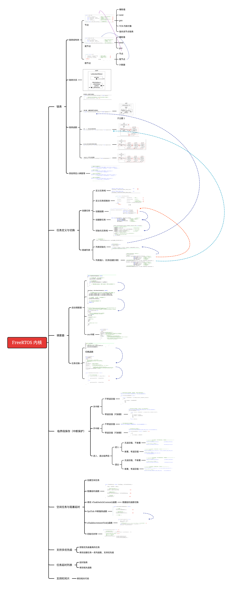

# 深入理解FreeRTOS内核实现
> 实现FreeRTOS内核来进行深入理解rtos
>
> [https://aeneag.xyz](https://aeneag.xyz)
>
> 艾恩凝
>
> 2021/12/12

## 文件说明

- backup 备份代码，只备份了最初的链表
- Doc 文档相关说明
- FreeRTO内核文件
- FreeRTOS/include 相关头文件
- FreeRTOS/port 平台相关代码
- Project keil项目
- User 主要实现任务main
- .vscode 支持VSCode，习惯用VSCode编辑代码，keil编译

代码在野火基础上修改，为了深入理解内核实现过程，修改代码，理解各个函数

## 内核流程

按照例程已经梳理了一遍内核，主要过程思维导图已展现了全部过程，为了加深理解，亲自上手实现一遍。

## 仿真效果

视频中，可以看出任务一个时间片就切换，仔细看过程，更改任务函数，可以更好的理解内核实现过程。

<video src="Doc/FreeRTOS.mp4" width="800px" height="200px" controls="controls"></video>
